[Return to BMX-SecureGateway](/Lab/Contents/BMX-SecureGateway/Readme.md)   


### Setup steps for the Sample CRM Secure Gateway

#### Creating a gateway to allow cloud to reach on OnPrem data


##### Before we continue:
 1. This guide will require you have a service to be exposed in a tcp port, then expose it via Secure Gateway Bluemix service. To help you with that, we provide the CRM Mockup as a sample of service to be exposed.

 1. This tutorial will also assumes you have `docker` installed on your machine. More about docker at [here](https://www.docker.com)


Let's start:

##### Adding Secure Gateway Service on bluemix account

- Access your bluemix account;

- On the right side menu, select `Integrate`;

    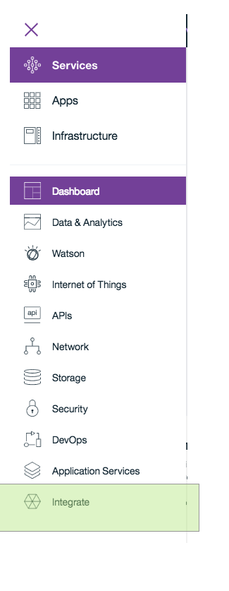

- Select then `Secure Gateway`;

    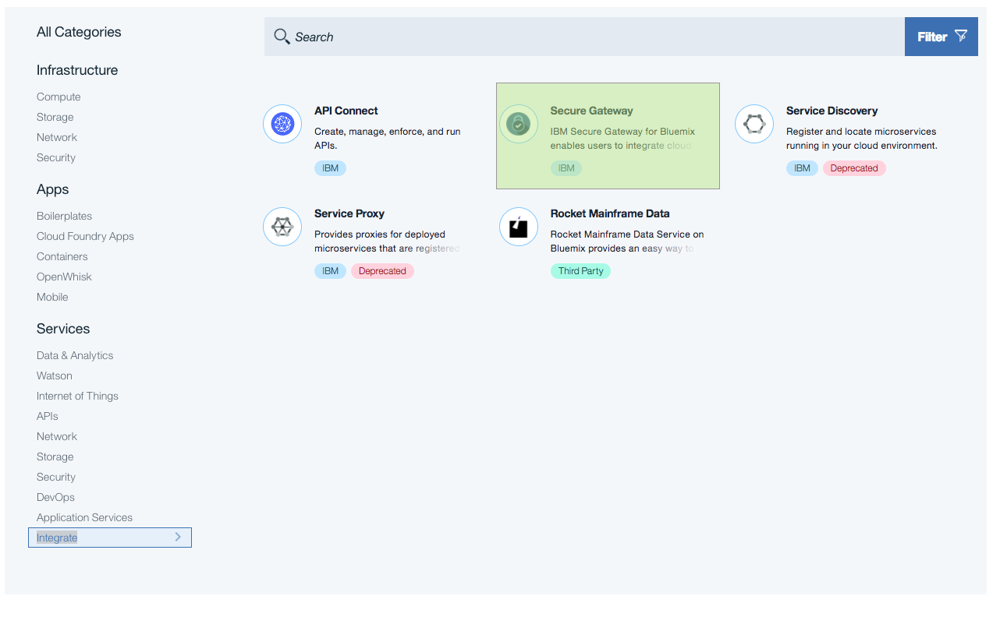
- Select your plan and press create;

    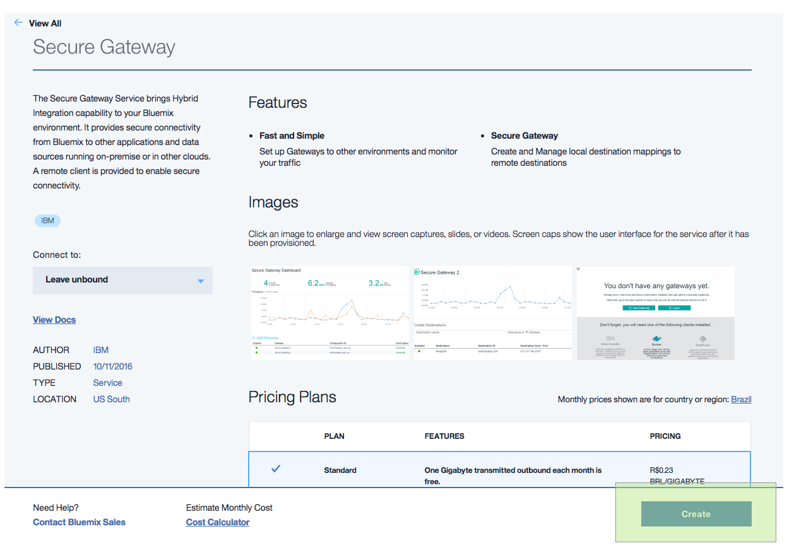

This will create on your account the bluemix service security gateway, that will allow you to connect your Bluemix Cloud Services to your On-Prem Services.


##### Creating an Gateway

Now, that you have Secure Gateway on your account let's add a gateway on it.

- On the `Secure Gateway Dashboard` press `+ ADD GATEWAY`;

    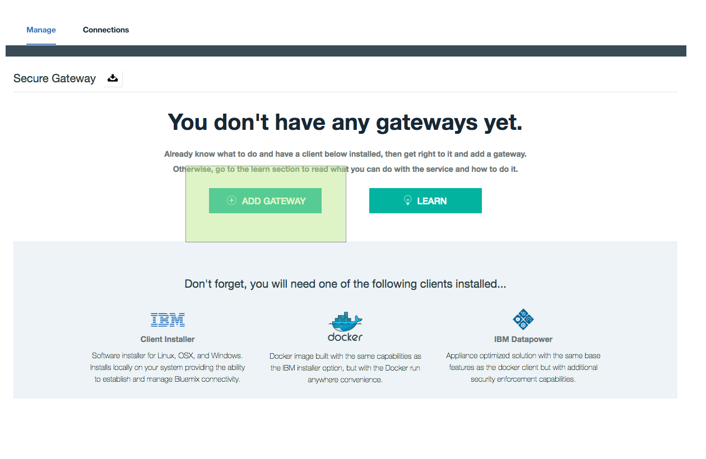

- Fill the main text field with the gateway name and press `ADD GATEWAY`;

    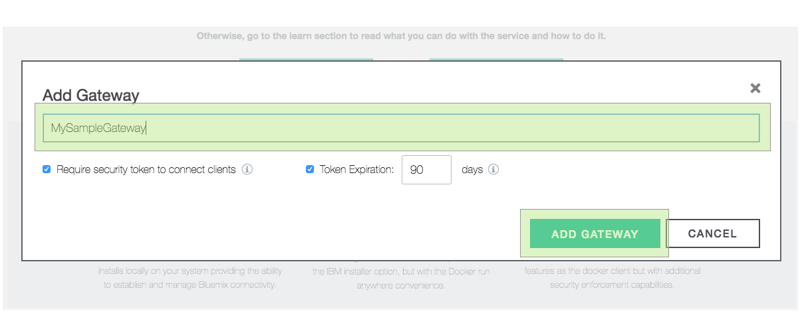

- After that you will have a gateway, without a `Secure Gateway Client`;

    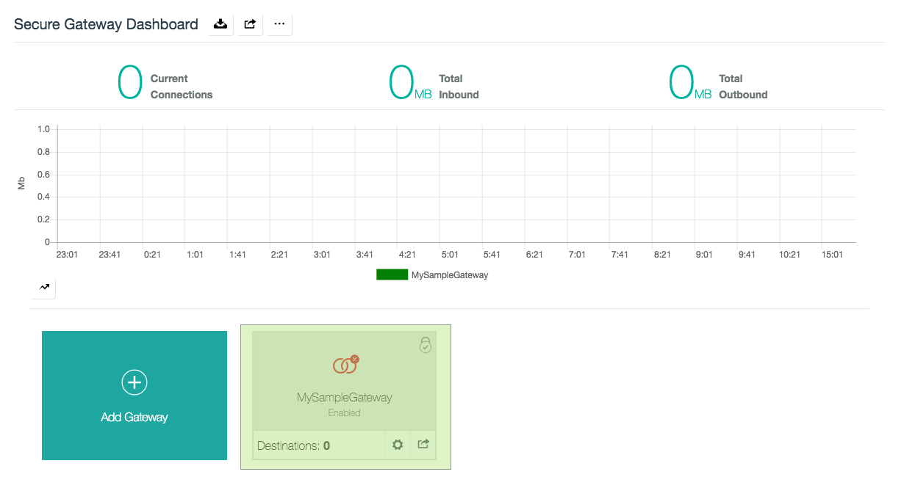


> :memo: **What is a gateway?:**  
> The gateway is a collection of destinations, it has secure token that allows it to be customized by the users.
>
> For details check: [Return to Secure Gateway intro](/Lab/Contents/BMX-SecureGateway/Readme.md)

##### Running the Secure Gateway Client

Now, that we have a gateway we will add a `Secure Gateway Client`, for this example we will use a [docker](https://docs.docker.com/) client to simplify the setup.  
&nbsp;
>**Observation:**   To this to run properly you need to have `docker` installed and ready to run on your machine.

If this is a new gateway, you will see a the red icon with `Disconnected` in the top right. This means your gateway has no client. So, you only have half of the elements to allow your gateway to work.

To solve that, we will do:

- On the top right of the secure gateway dashboard, press on `Add Client`;    

  

- Select `docker` and then first clipboard that contains the command to run your secure gateway client;

  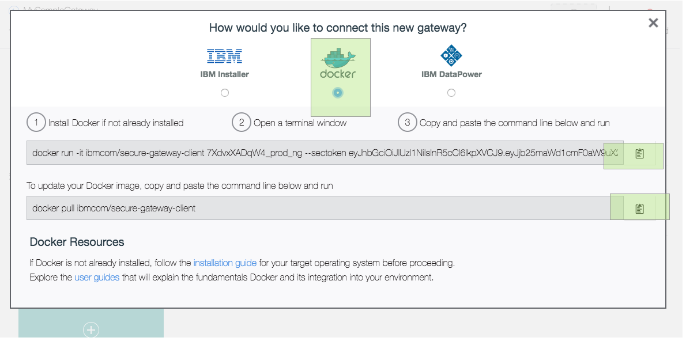

- Run that command on your docker host(eg: your machine) terminal;

  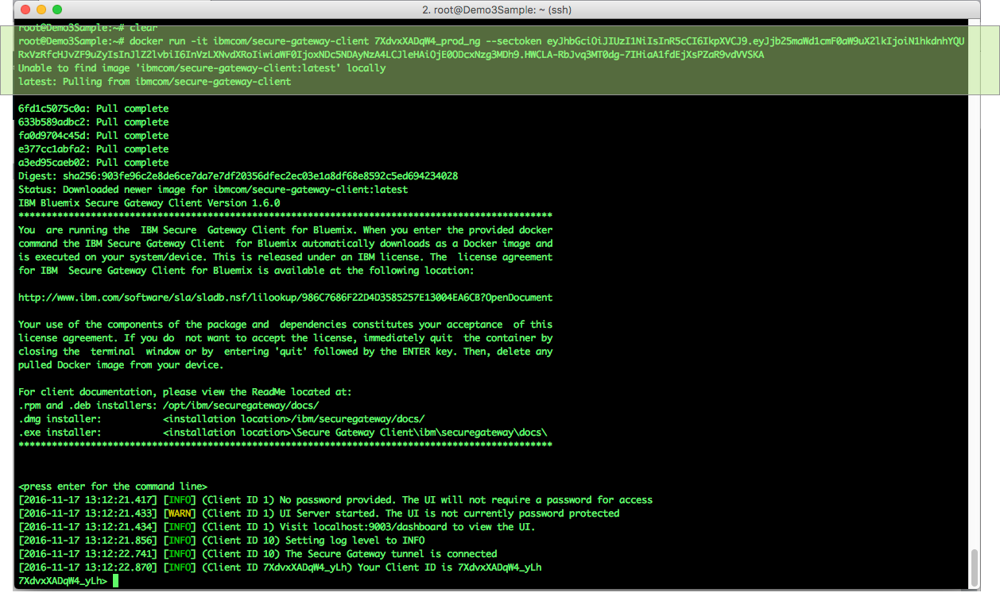

Once all it is done you will see:

  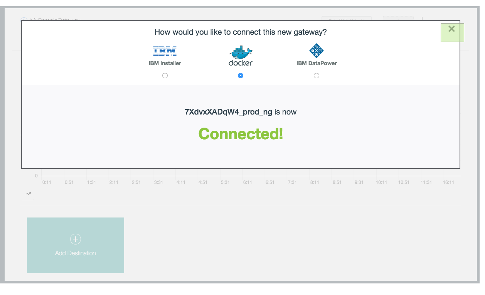

> After you run, you will see the docker client command line that allow your to customize your client.


&nbsp;

> :memo: **Why do I need the client?**
>
>  Secure Gateway is a bridge between 2 networks. To allow it to work properly you need a client that is in an "OnPrem" network to allow the Bluemix environment to reach it. So, for this example we will have a endpoint on bluemix that will receive the requests and tunnel it to the Secure Gateway client to call the resource in the "OnPrem" network.
>
> The Secure Gateway client and the service/resource you want to reach in the "OnPrem" network do not need to be on the same machine, as long as the client machine can reach the service desired(eg: able to ping it), it will do the proper routing to it.
>
> **Secure Gateway Client** act as a **proxy** for the cloud servers in your **OnPrem** network.


##### Creating a Destination

Now, that we have a `gateway` and a `gateway client` we can add a `destination` on your Secure Gateway.

> :memo: **What is a destination?**
>
> It is a endpoint on bluemix that will receive the calls from the cloud-side(Bluemix) and tunnel it in to your OnPrem resource, in this example, the CRM Mockup.

- At your new `gateway` dashboard press `Add Destination`:

  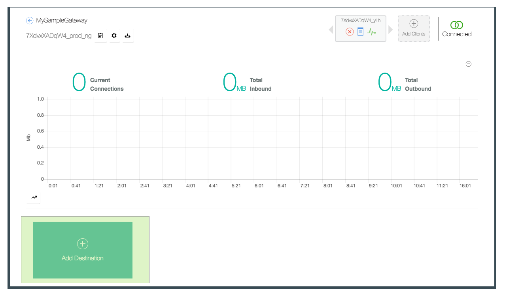

- On the destination wizard press `Advanced Setup`:

  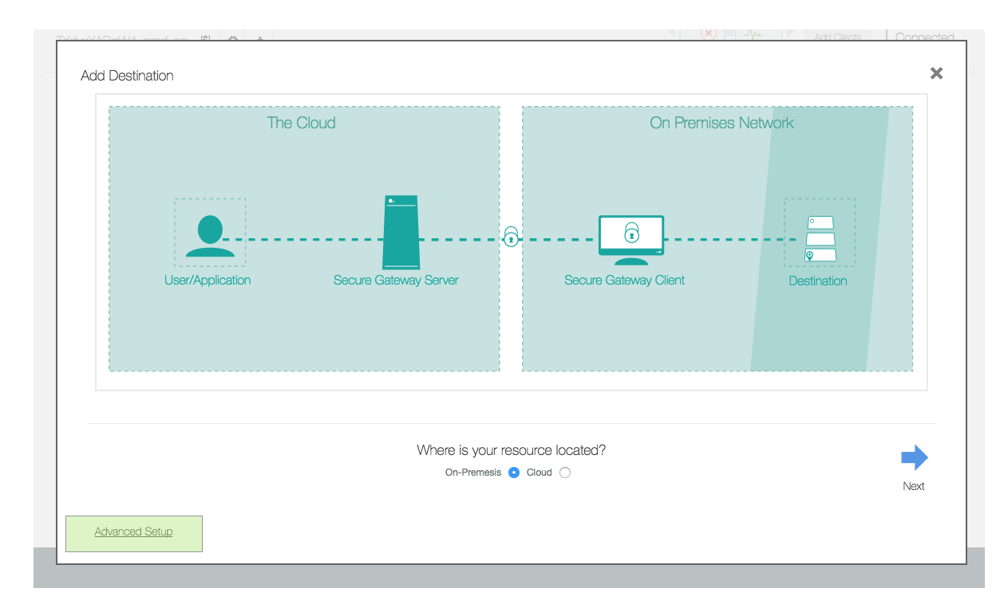

- On the `Advanced Setup` screen:
  - Select `On-Premises Destination`;
  - Fill the destination name;
  - Fill the destination hostname or ip(eg: the CRM IP on your network);
  - Fill the destination port(eg: the CRM port, by default 8000);
  - Ensure that for now, the checkbox `Restrict cloud access to this destination with iptable rules` is not marked;

  > **Note:** Resource Hostname is the IP or Hostname which the Secure Gateway client will use to reach the resource you want to expose. In this Lab it is the CRM Mockup host IP(probably your machine ip) and the port is the port your nodeJS is exposing by default 8000.

  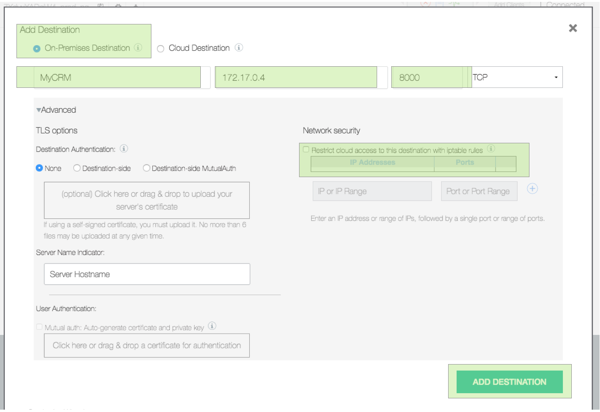

- Once the `destination` is created you will observe a red hand on it, it means the destination is not reachable by the cloud side due to its `ACL` is not allowing it.

  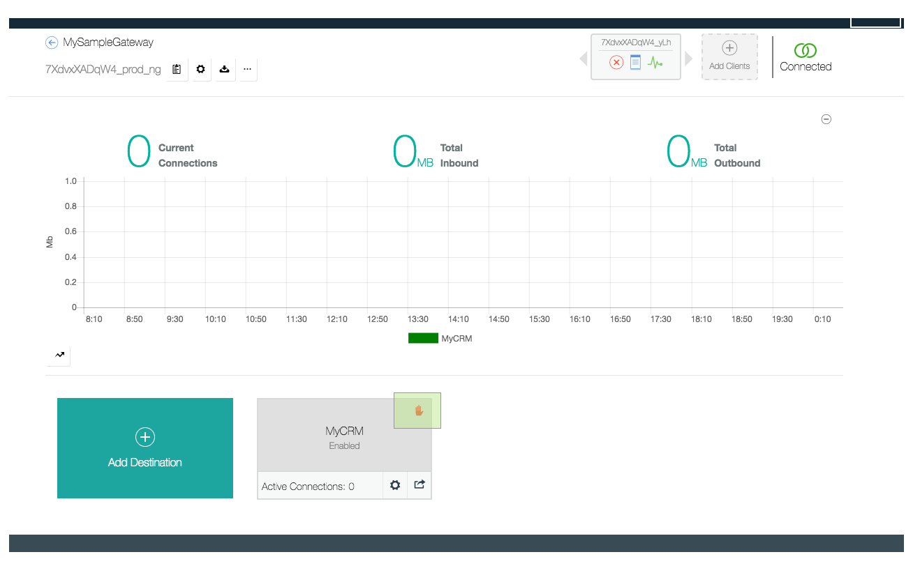

  


- To solve that, go back to your terminal with the `gateway client` command line and type:
  ```
  A <YOUR CRM IP>:<CRM PORT>
  ```

  For example:

  ```
  A 172.17.0.4:8000
  ```

  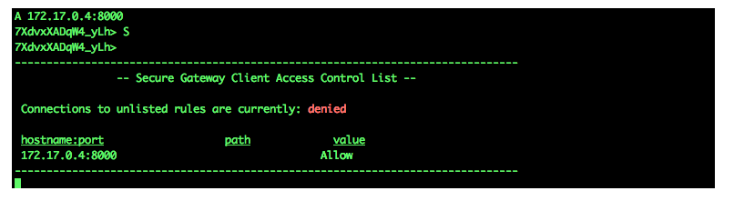

  > If you want to to check the available rules in your ACL just press `S` on the command line.

- Now the `red hand` will not appear anymore, and your CRM will be reachable;

  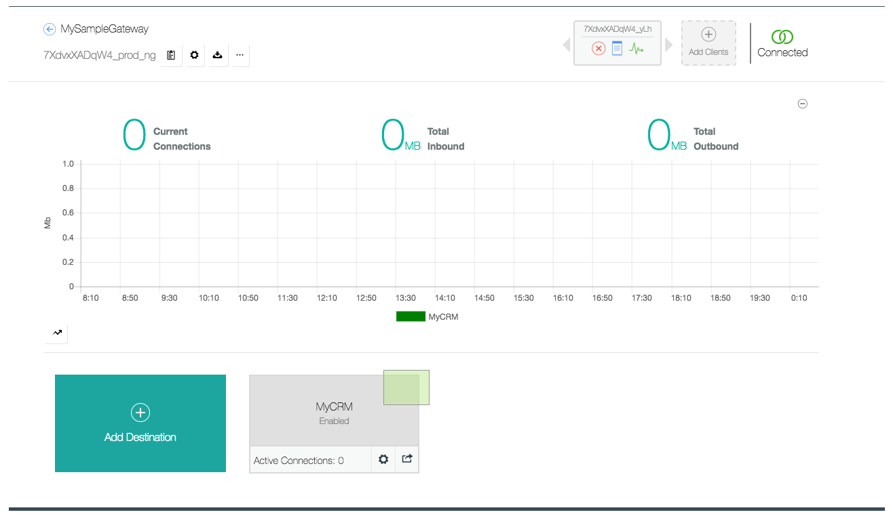

- Once this is done your `destination` will be available at a bluemix managed route;

  


You have completed the setup of your `gateway`, `gateway client` and `destination`. For now we set the destination unportected to help you to get familar with Secure Gateway, but at [this guide](/Lab/Contents/BMX-Java-Message-Hub-Consumer/Segure-Gateway-Protection.md) we will show how to protect this gateway also allow the `Message Hub Java Consumer` to automatically update the Gateway firewall.


##### Testing your OnPrem Service(optional)

Now that all is created and configured, let's test it. As this is a public(not protected yet) gateway you will be available to test via your browser.

To know how to the address of your destination to the following:

- On your `gateway` dashboard press on the `engine` symbol of your destination;

  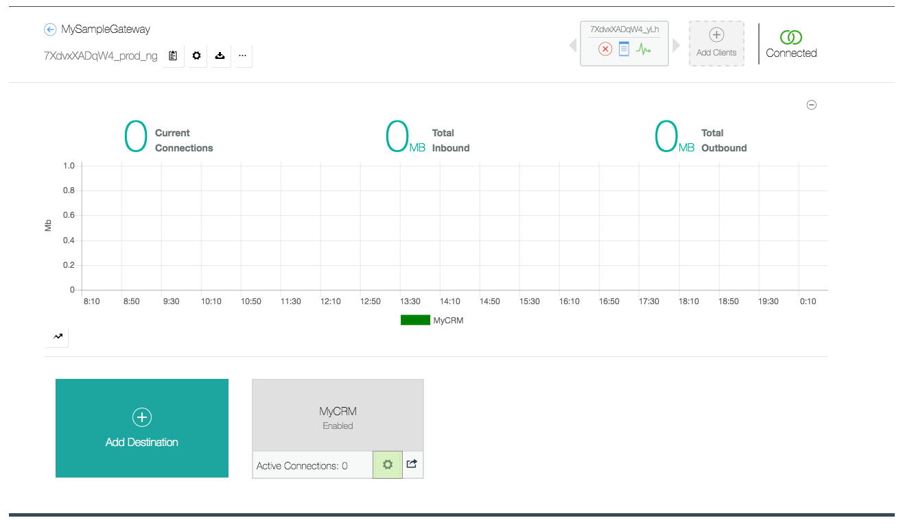

- Observe the popup shown,at the property `Cloud Host : Port`, this is your destination url;

  

- Copy this URL and past in your browser and you will see the list of your customer on the CRM:

  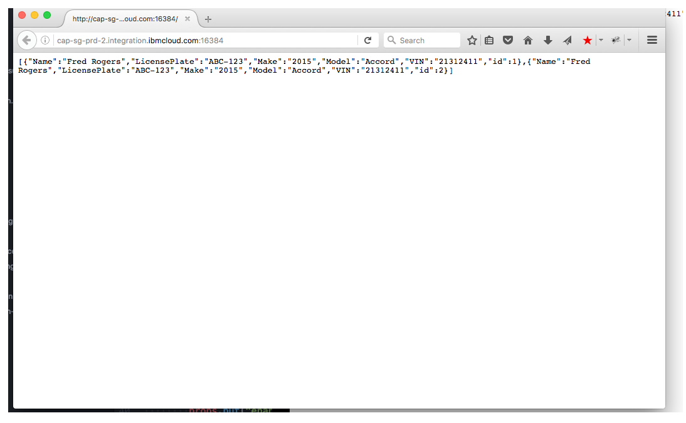

Now, if you see a JSON object this means this setup worked as expected.


#### Further comments about ACL List


##### What is the ACL List?

 The ACL it is a local firewall on the client side of the tunnel, in this case the OnPrem side, that allows you to create rules to allow or block some server addresses and ports.

:memo: **How do pre-load it on my docker container?**

For that you can start the client container sharing a folder with your host machine that contains an ACL file or create your own container that extends the secure gateway client one, adding your ACL file during its build process.  

Sample acl.txt content:
```txt
acl allow 172.17.0.4:8000
```

```bash
#then to allow a server to be reach
#full version - all flags
docker run -it -v /ACLList/Folder/OnHost/:/var/settings/  --name sgw_client ibmcom/secure-gateway-client $GATEWAY_ID --sectoken eyJhbGciOiJIUz--along-token---sKzCov5Fcr5U --F /var/settings/acl.txt
```


#### (optional) Restricting the access to the gateway - MFP on bluemix

This will be covered on [this guide](/Lab/Contents/BMX-Java-Message-Hub-Consumer/Segure-Gateway-Protection.md).


### Extra References:

<https://console.ng.bluemix.net/docs/services/SecureGateway/sg_023.html#sg_023>

<https://developer.ibm.com/bluemix/2015/03/27/bluemix-secure-gateway-yes-can-get/>

<http://www.ibm.com/developerworks/library/se-connect-data-center-with-bluemix-secure-gateway-service/index.html>

<https://docs.cloudfoundry.org/running/managing-cf/logging.html>

<https://developer.ibm.com/bluemix/2015/11/11/secure-gateway-in-production-part1/>

<https://developer.ibm.com/bluemix/2015/11/18/secure-gateway-in-production-part2/>

<https://developer.ibm.com/bluemix/2015/04/17/securing-destinations-tls-bluemix-secure-gateway/>

<https://developer.ibm.com/bluemix/2015/04/07/reaching-enterprise-backend-bluemix-secure-gateway-via-sdk-api/>

<https://developer.ibm.com/bluemix/2015/04/01/reaching-enterprise-backend-bluemix-secure-gateway/>


## Next guide

[BMX-Java-Message-Hub-Consumer](/Lab/Contents/BMX-Java-Message-Hub-Consumer/Readme.md)   
