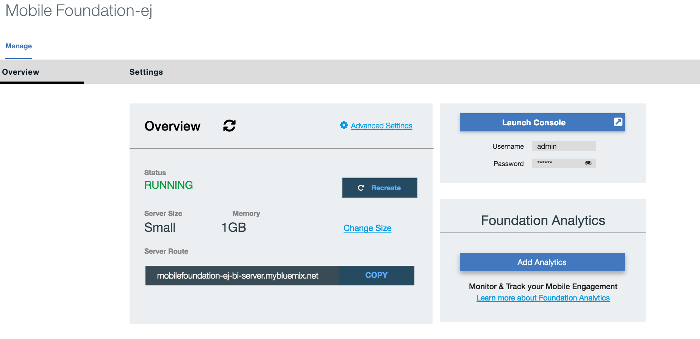
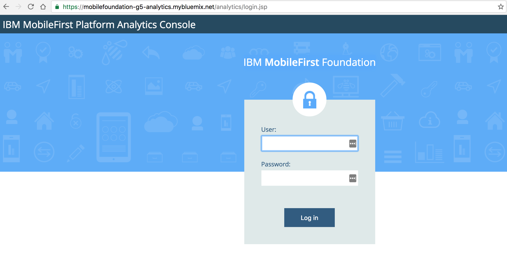
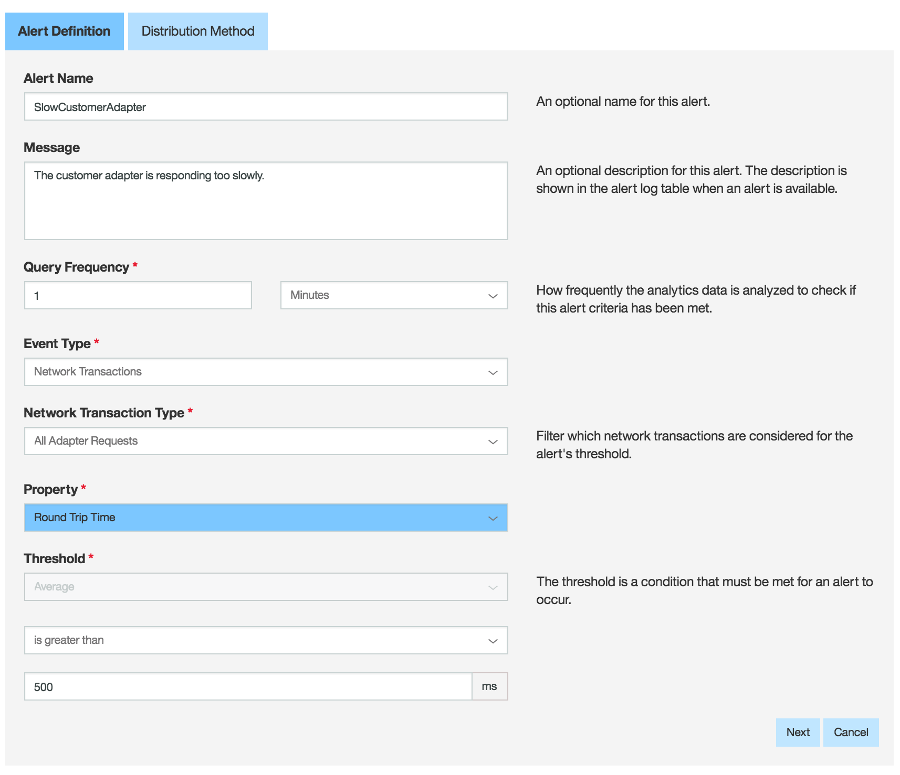
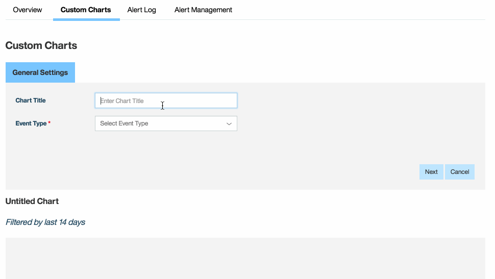

#  Mobile Analytics

After successfully launching your application, you'll want to monitor how your app is performing so you can continually improve it. You'll want to identify problems & diagnose issues quickly, and you'll want to understand how users are using your app, so you can ultimately make it easier for customer service reps to assit customers.

Im this lab, we will be exploring MobileFirst Foundation Analytics on Bluemix, and how to use it to get insights into both app performance & app issues.


## What you will learn on this guide

 - Setup Mobile Analytics Bluemix service
 - Infrastructure tab in Analytics Console
 - Using web hooks with Analytics service
 - Send custom analytics logs and create a custom chart

## Requirement of this guide

- Setup your MobileFirst Foundation service on Bluemix from the first lab
- Have your Ionic lab up and running

## Guide

### Setting up Analytics Service
1 - Create a container to setup your namespace if you do not already have a container in your space. 
If you have setup a container previously you can skip this step. 


> After creating a container it can take some time to for the namespace to be created.

2 - In your Foundation service, select "Add Analytics", this can take some time.



3 - Once created, it will show up in your space as "mobilefoundation-g5-a...". 


4 - Go to the url `https://mobilefoundation-g5-analytics.mybluemix.net/analytics/console` there you will see the analytics console.
Use the same username/password found in your MobileFirst Foundation service.



### Infrastructure Tab
Let's say you notice that some apps are starting to have a slow loading time either to search a customer or view customer details.
You could go into the analytics console, and see the infrastructure tab in order to view real time data into who the culprit of the issue is or even times of the day that it is frequently happening.


### Alerts Configured with Web Hooks
Let's say your business needs dictact that your admin find out immediately when these network transactions become slower.

You could easily create an alert within the analytics console that would be triggered whenever an adapter requests takes more than 500 ms.
This will trigger an alert at the query frequency you set (set here at 1 min).
The analytics console automatically handles this issue, and logs it for the admin to view in the analytics console alert logs.



Let's say your admin is not able to view the analytics console at all times. The analytics console allows webhooks to be triggered by an alert, that can consume the response and either email or send a push notification to the admin. This can allow multiple stakeholders to receive necessary information in a timely manner. Please see this [blogpost](https://mobilefirstplatform.ibmcloud.com/blog/2015/10/19/using-mfp-adapters-endpoint-analytics-alerts-webhooks/) to learn more about configure webhooks.


## Custom Analytics
Your business needs are expanding and you want to find more information that is pertinant to your specific organization and how it can improve this app. Using custom analytics, you can create charts that help your organization better analyze how to better serve your business needs.

> Documentation about custom analytics can be found [here](https://mobilefirstplatform.ibmcloud.com/tutorials/en/foundation/8.0/analytics/custom-charts/).

### 1 - New Visits Created in the App

Let's say you want to see how many new customers are coming in via a timeline. You can create a custom analytics event such as `NewVisit` to see the spikes in when users are coming in.

> Please note that you will not be able to see the custom analytics property (i.e. "NewVisit") until an analytics log of that property has been sent to the analytics server. Please run through the app at least once before creating the custom charts.

In `MotoCorp/www/app/controllers/new-visit.js`, the following code adds custom analytics for new visits.

```bash
/* Custom analytics tracking how many new customers created in app */
WL.Analytics.log({ NewVisit: '1' }, results);         
WL.Analytics.send();
```

To Create the Custom Chart


### 2 - New Customers Created in the App 

Now let's say your business wants to see when more new customers are coming into your car service center throughout the year to better distribute out promotions. You can create customer analytics across a timeline to view the frequency of new customers throughout the year. 

In `MotoCorp/www/app/controllers/new-customer.js`, the following code adds custom analytics.

```bash
/* Custom analytics tracking how many new customers created in app */
WL.Analytics.log({ NewCustomer: '1' }, results);         
WL.Analytics.send();
```

To Create the Custom Chart


## Conclusion

MobileFirst Analytics creates a robust out of the box analytics service for MobileFirst apps so that business needs can be evaluate more quickly and configured easily within the application.