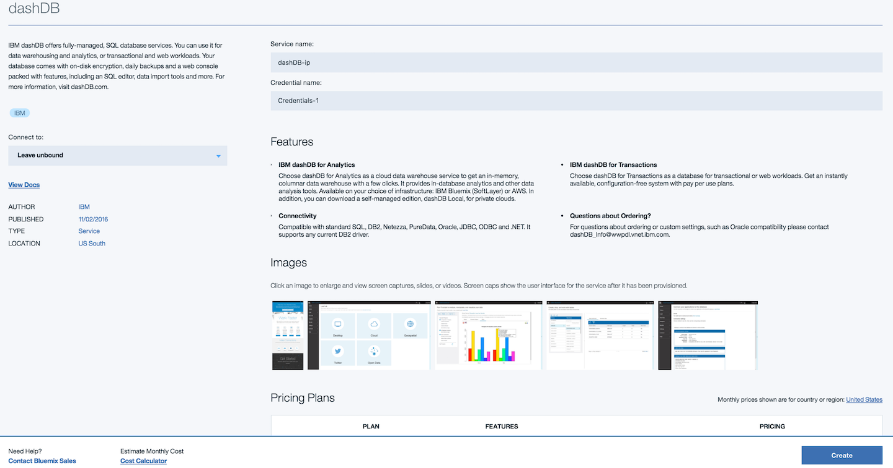
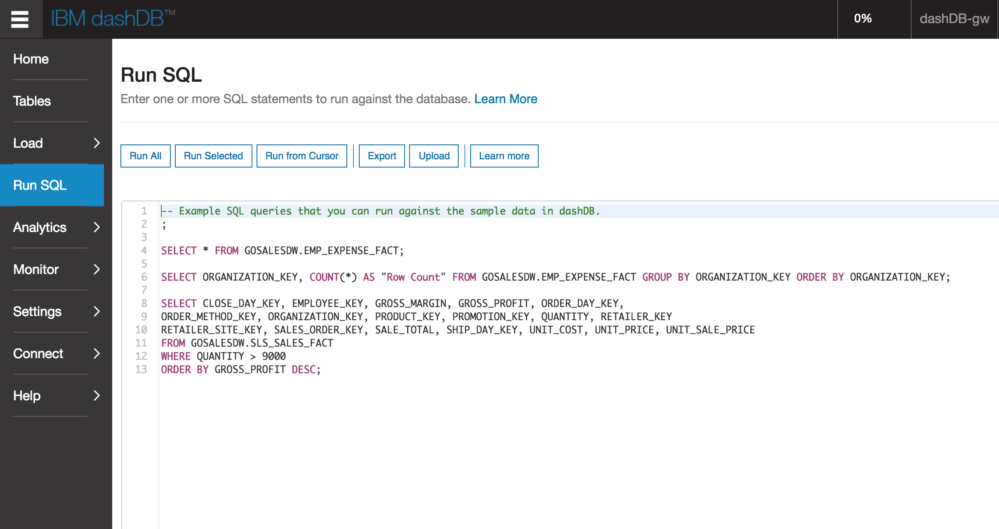
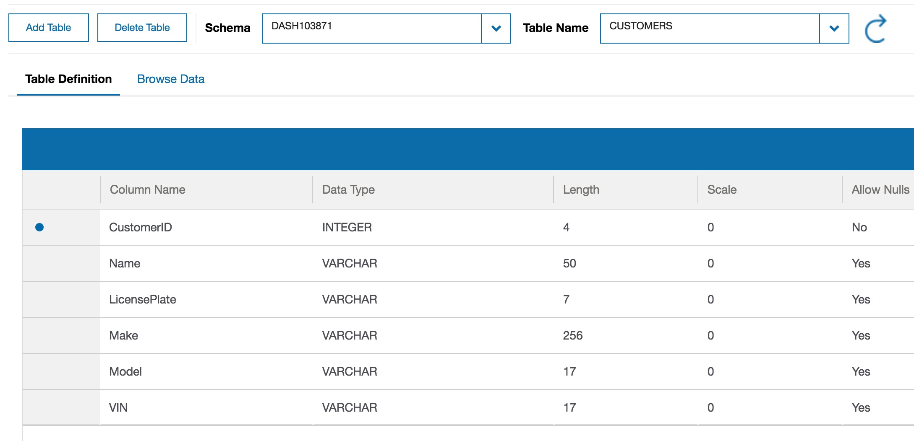
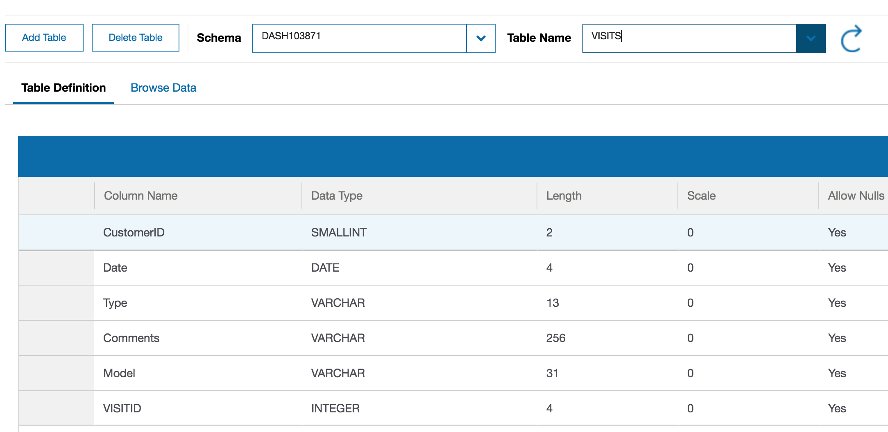
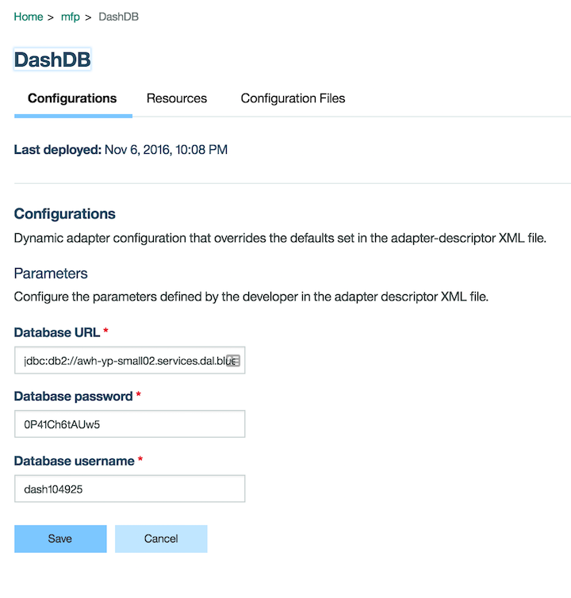

#  Mobile Foundation - DashDB Adapter

This lab will demonstrate how to create a DashDB java sql adapter to read information from a DashDB database.

## What you will learn on this guide

 - How to create a DashDB Service on Bluemix
 - How to create a DashDB adapter for Mobile Foundation
 - How to test this adapter

## Requirements of this guide

- [Mobile Foundation Setup](/Lab/Contents/MFP-Setup-Mobile-Foundation-on-Bluemix/Readme.md)

## Guide

### Instantiating the DashDB Service

1 - Instantiate the [DashDB Service](https://console.ng.bluemix.net/catalog/services/dashdb/) by clicking `Create`.


2 - In the Bluemix console, get your username and password from the location shown below.
You will need these later to configure your adapter.


3 - Open your DashDB console where you will see the following screen.


### Create Customer and Visit Tables

1 - To create the customer and visit tables, run the following sql commands "Run SQL" in the section show below.
```sql
CREATE TABLE CUSTOMERS (
 "CustomerID" INTEGER NOT NULL,
 "Name" VARCHAR(50),
 "LicensePlate" VARCHAR(7),
 "Make" VARCHAR(256),
 "Model" VARCHAR(17),
 "VIN" VARCHAR(17),
 PRIMARY KEY ("CustomerID")
);

CREATE TABLE VISITS (
 "CustomerID" SMALLINT,
 "Date" DATE,
 "Type" VARCHAR(13),
 "Comments" VARCHAR(256),
 "Model" VARCHAR(31),
 "VISITID" INTEGER
);
```

2 - Once finished you will see your tables in "Tables"





### Deploying the DashDB Adapter

1 - Build the adapter 
```bash
cd ./Adapters/DashDBAdapter
mfpdev adapter build
```
2 - Deploy the adapter in the console, by uploading the `DashDbAdapter.adapter` file.

3 - Set your username and password for your DashDB Adapter in the mfp console.
The database url is already set to the default url on bluemix.
> You can also set these credentials `MotoCorpService/Adapters/DashDBAdapter/src/main/adapter-resources` in your `adapter.xml`.



### DashDB Adapter - How it Works

In the `pom.xml` there's a dependency on a DB2 jar driver that is provided in the project.

```xml
<dependency>            
   <groupId>com.ibm.db2.jcc</groupId>
   <artifactId>db2jcc4</artifactId> 
   <version>1.0.1</version>
   <scope>system</scope>
   <systemPath>${project.basedir}/lib/db2jcc4.jar</systemPath>
</dependency>
```

In `JavaSqlApplication.java` add the DB2 driver name in the `init()` function.
```java
dataSource.setDriverClassName("com.ibm.db2.jcc.DB2Driver");
```

To execute a sql query to `getAllUsers` in the java adapter, you will need to do a couple of things.

1 - Create a JSONArray to store the response to return
```
JSONArray results = new JSONArray();
```

2 - Create a sql connection
```
Connection con = getSQLConnection();
```

3 - Create the sql query you will be using to query DashDB
```
PreparedStatement getAllUsers = con.prepareStatement("SELECT * FROM CUSTOMERS");
```

4 - The data ResultSet will hold the response from the sql query
```
ResultSet data = getAllUsers.executeQuery();
```

5 - Parse the data response and add it to your JSONArray

```
while(data.next()){
    JSONObject item = new JSONObject();
	item.put("CustomerID", data.getInt("CustomerID"));
	item.put("Name", data.getString("Name"));
	item.put("LicensePlate", data.getString("LicensePlate"));
	item.put("Make", data.getString("Make"));
	item.put("Model", data.getString("Model"));
	item.put("VIN", data.getString("VIN"));

	results.add(item);
}
```

6 - Close all your connections
```
getAllUsers.close();
con.close();
```

7 - Return your response
```
return Response.ok(results).build();
```

### Testing in Swagger

To test the adapter, go into Swagger. 
Select [GET] /getAllUsers and you will see all the data in your table.
Since your table does not have any data yet, you should see a 200 status with no response.
Below is an example of what the result would look like when there is data in your Customers table.


## Next guide

[NodeJS-CRM-OnPrem](/Lab/Contents/NodeJS-CRM-OnPrem/Readme.md)   
