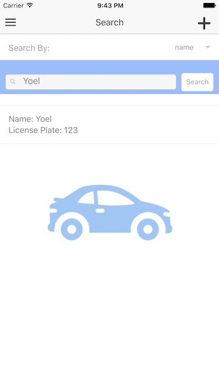

#  Mobile Foundation - Ionic Mobile App

In this lab we will be going over how to integrate MobileFirst Foundation adapters with our Ionic app.
We will be going over basic Ionic terms as well as how we can easily and quickly implement the adapters with the UI. At the end of this lab, you will be able to search customers, see customer profiles, add new customers, and add new customer visits by utilizing MobileFirst adapters.

## What you will learn on this guide

- Setup the app
- Review the basic structure of our **Ionic app**
- **Integrate adapters** into the app to setup the following functionality:
  - Customer Search
  - Customer Profile
  - Add New Customer
  - Add New Customer Visit

## Requirement of this guide

  - [Login Security Test](/Lab/Contents/MFP-Security-Implement-Login/Readme.md)  
  - [Customer Adapter](/Lab/Contents/MFP-Customer-Adapter/Readme.md)

# Guide

## Add the iOS Platform

The first thing you will need to do is go to the correct folder where the app is located

  ```bash
  cd MotoCorpService/MotoCorp/
  ```

  Next you need to add the iOS platform.

  ```bash
  ionic platform add ios
  ```

  > Currently Android platform has not been tested.

## Adding the MobileFirst Cordova SDK

  The MobileFirst Cordova SDK is provided as a set of Cordova plug-ins and can be installed by running:

  ```bash
  cordova plugin add cordova-plugin-mfp
  ```

## Register your app with your MobileFirst Server

  Make sure that your MFP server is running and enter the command below to register the app.

  ```bash
  mfpdev app register mybluemixmfp
  ```

  Open your MobileFirst Console and confirm that your app has been registered.


## Build and run the app

  Build the iOS platform. You will need to do this every time you make a change in the app.

  ```bash
  cordova build
  ```
  ```bash
  cordova emulate ios
  ```

## Testing

  Follow the following steps to test the functionality of the app:

  - When the app starts it will ask for you to log in. You can use the default credentials or use “demo” for both the username and password.
  - Create a new customer - on the search screen, you can touch the plus button in the upper right hand corner to add a new customer. You will be able to add their name, plate, make, model, and vin.
  - On the search screen, press the search button with no filter and no text and you will see the new customer you created.
  - If you select the customer on the search screen, it will take you to the customer detail screen. You can add a customer visit to the customer by pressing the plus button.

# Structure of the App

> This lab uses an app that was created using Ionic 1. If you have Ionic 2 intalled, you can still run it.

Ionic uses what they call **views** and **controllers** to configure how your app looks and functions.
- The **views** are the html files which governs how your app will look.
- The **controllers** are the javascipt files which tell your corresponding view how to function. We pair each view with its own controller to abstract it from other segments and make it easier to read and understand.

In Ionic, **Factories** are the most popular way to create and configure a **service**.
- A **Factory** is basically just an object that you add properties to and return. When your controller uses this service, the properties are available to be used by the controller. This helps to reuse code in different parts of the app without having to write the same things over again.
- We will be using a service called **CRM** to call the MobileFoundation adapters.

Here is some **Ionic verbiage** you will see in the html views:

- **Directives** are a way to extend the html attributes.
- The **ng-model** directive binds the value of an input field to a variable created in the controller.
- The **ng-click** directive tells Ionic what to do when an HTML element is clicked.
- The **ng-repeat** directive repeats a set of HTML, a certain number of times.
- **Scope variables** that are defined in the controller can be displayed in the html view surrounded with double curly braces. For example:
A controller defines a customer variable like this:

```js
$scope.customer = “Rob”;
```

The value of the customer variable can be displayed in the html like this:

```js
{{customer}}
```


## Lab Requirements

Before we start, make sure that you start your **Nodejs backend server** that you setup in a
[previous lab](https://github.ibm.com/cord-americas/MotoCorpService/blob/master/Lab/Contents/NodeJS-CRM-OnPrem/Readme.md).

> To test that your server is up and running, you should see a json response when you run:

> ```bash
curl -XGET http://localhost:8080/customers
```

### CRM Service

Let’s take a look at the CRM service where the MFP magic happens. These are the functions that will call the CustomerAdapter adapter that we made in the [CustomerAdapters](https://github.ibm.com/cord-americas/MotoCorpService/blob/master/Lab/Contents/MFP-Customer-Adapter/Readme.md) lab.

Open **crm.js** located in the **/MotoCorp/www/app/services** directory.

The code below is the main function that communicates with the CustomerAdapter.

```javascript
function sendRequest(path, method, payload) {
    var req = new WLResourceRequest(path, method);
    req.setHeader('Content-type', 'application/json');
    return req.send(payload).then(function (response) {
      return response.responseJSON;
    }, function (error) {
      return WLJQ.Deferred().reject(error.responseText).promise();
    });
  }
```
The **sendRequest** function takes the following parameters:

- **path**: the adapter endpoint
- **method**: the HTTP method we can to use (GET, POST, etc)
- **payload**: what we want to send to the endpoint

The **WLResourceRequest** class handles resource requests to the CustomerAdapter. It sets the Content-type in the header and sends the payload to the adapter which will return a JSON response.

## Customer Search
Let's look at the search function in the CRM service that our app will use to call the adapter.



In **crm.js** you will see the search function:

```javascript
search: function (query) {
      return sendRequest('/adapters/CustomerAdapter/resource/searchCustomer', WLResourceRequest.POST, query);
    }
```

The CRM service uses this function to send requests to the CustomerAdapter adapter.

The UI calls this search function which we will look at next.

Open the **app/controllers/search.js** file and you will see the scope variables that we will use.

```js
$scope.results = [];
$scope.search = {
  "text":"",
  "type":"plate"
};
```

The **$scope.searchPlate** function sends the search payload to the search function at the CRM service:

```javascript

$scope.search.text = this.query;

CRM.search($scope.search).then(function (results) {
  if(results.length === 0) {
    alert('No match found');
  } else {
    $scope.results = results;
    $scope.$apply();
  }
}).fail(function (error) {
  alert(error);
});
```
The **search** variable gets the type of search you want from the UI (name, plate, or vin) along with the search keywords you type in.

**CRM.search()** sends the search payload to the search function at the CRM service.


## Customer Details
When the search completes, you will see the response under the search bar. The user can touch the results to take you to the customer detail screen. Let's see how it works now.


In **crm.js**, the **getCustomer** function takes a **plate** argument and sends it to the CustomerAdapter adapter and returns the customer with the specific license plate.

```javascript
getCustomer: function (plate) {
      return sendRequest('/adapters/CustomerAdapter/resource/customers/' + plate, WLResourceRequest.GET);
    }
```


Open the **app/controllers/view-customer.js** file and you see the **plate** variable that gets the customer plate parameter from the url that was called when we touched the search results.

```js
var plate = $state.params.plate;
```

**CRM.getCustomer()** sends the **plate** to the getCustomer function in the CRM service and returns the customer object.

```js
CRM.getCustomer(plate).then(function (customer) {
    $scope.customer = customer;
    $scope.$apply();
  }).fail(function (error) {
    alert(error);
  });
```

## New Customer Visit
At the top right hand corner of the customer detail view, there is a plus button to add a new customer visit. We first need to return to the CRM service to call the adapter.


In **crm.js** you can see the **newVisit** function which takes a **customerId** and **visit object** parameter and sends it to the CustomerAdapter adapter and posts it to the customer object.

```javascript
newVisit: function (customerId, visit) {
  return sendRequest('/adapters/CustomerAdapter/resource/' + customerId + '/newVisit', WLResourceRequest.POST, visit).then(function (response) {
    if (activeCustomer !== null) {
      if (!(activeCustomer.visits instanceof Array)) {
        activeCustomer.visits = [];
      }
      activeCustomer.visits.push(visit);
    }
    return response;
  });
}
```

Open the **app/controllers/new-visit.js** file and you will see the **visit** variable that we will save our new visit object in.

```js
$scope.visit = {
    date: new Date(),
    type: null,
    comment: null
  };
```

**CRM.newVisit()** sends the **id** and the **visit object** to the newVisit function in the CRM service and then takes us back to the customer detail screen.

```js
CRM.newVisit(id, {date: $scope.visit.date,type: $scope.visit.type,
  comment:$scope.visit.comment}).then(function(response){
      alert('Added New Visit');
      $ionicHistory.goBack();
    }).fail(function(error){
      alert(error);
    });
```


## New Customer
If a customer isn't in the database, you will first need to add them. On the search screen, you can touch the plus button in the upper right hand corner to add a new customer. You will be able to add their name, plate, make, model, and vin.


In **crm.js** you see the **newCustomer** function that sends the new customer payload to the CustomerAdapter.

```javascript
newCustomer: function (customer) {
      return sendRequest('/adapters/CustomerAdapter/resource/newCustomer', WLResourceRequest.POST, customer);
    }
```

In the newCustomer function, **CRM.newCustomer()** sends the customer details that you enter into the form as a **customer object** to the newCustomer function in the CRM service.

```js
CRM.newCustomer(myCustomer).then(function () {
  alert("New customer submitted!");
  var plate = {
    id: $scope.customer.LicensePlate
  };
  $state.go('app.customer', plate);
});
```
