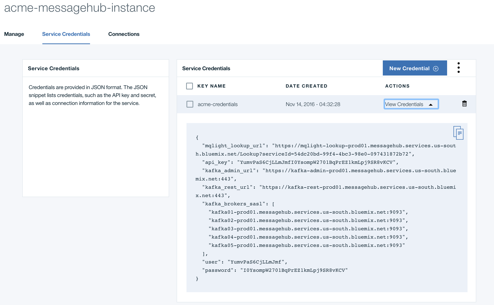
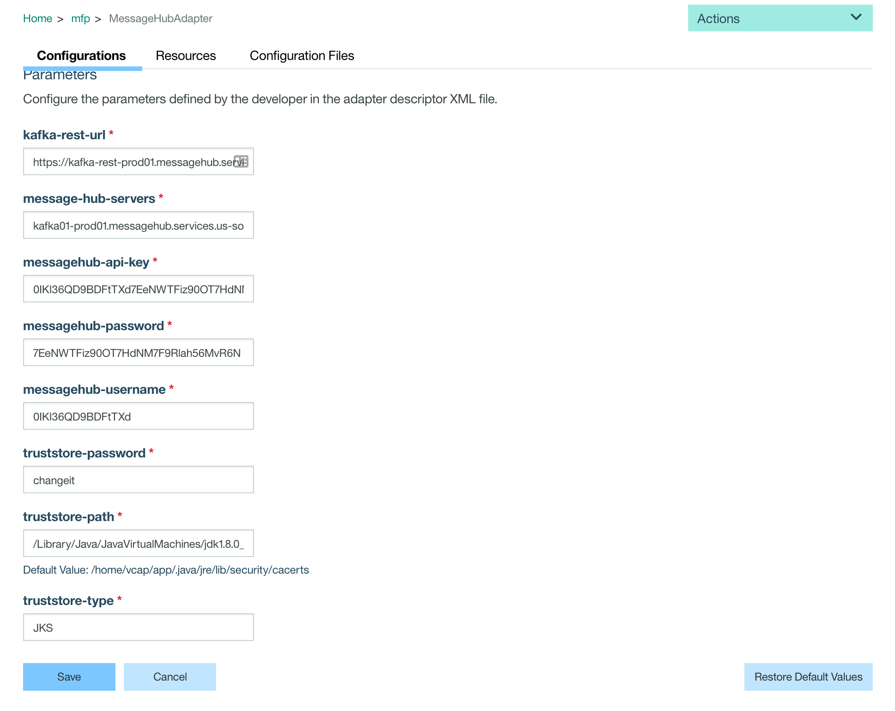
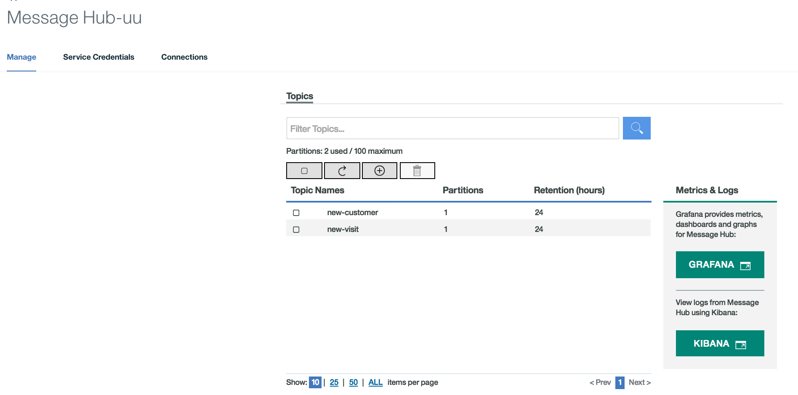

#  Mobile Foundation - MessageHub Adapter

MessageHub is a scalable, distributed, high throughput message bus in the cloud, available as a fully managed Bluemix service.
The MessageHub Adapter creates topics that are written to MessageHub instead of directly to the CRM to lighten the load on the CRM.

## What you will learn on this guide

- How to create a Message Hub Service on Bluemix
- How to create a Message Hub adapter for Mobile Foundation
- How to test this adapter

## Requirement of this guide

- [Mobile Foundation Setup](/Lab/Contents/MFP-Setup-Mobile-Foundation-on-Bluemix/Readme.md)


## Guide

### Creating the Message Hub Service

1 - Instantiate the [Message Hub Service](https://console.ng.bluemix.net/catalog/services/message-hub/) by clicking `Create`.


2 - In the Bluemix console, save the credentials. You will need them later to configure your adapter.


3 - Open your MessageHub console where you will see the following screen.


### Deploying the MessageHub Adapter

1 - Build the adapter
```bash
cd ../Adapters/MessageHubAdapter/
mfpdev adapter build
```
2 - Deploy the adapter in the console, by uploading the `MessageHubAdapter.adapter` file.

3 - Set your credentials for your MessageHub service in the mfp console.
The following properties only need to be changed if they don't match your credentials or if you want to use a specific TrustStore other than the default:
  - `messagehub-api-key`
  - `messagehub-password`
  - `messagehub-username`

> You can also set these credentials `MotoCorpService/Adapters/MessageHubAdapter/src/main/adapter-resources` in your `adapter.xml`.

> If you are running this adapter on a local instance of MobileFirst Foundation, you will need to import MessageHub certificate to your truststore as can be seen [here](https://docs.oracle.com/cd/E19830-01/819-4712/ablqw/index.html)



### MessageHub Adapter - How it Works

The next section of the lab explains how the adapter was written.

In the `pom.xml` there are dependencies for the MessageHub Client (`org.apache.kafka.kafka-clients`), logger (`org.slf4j.slf4j-log4j12`), and Java object mapper (`com.fasterxml.jackson.core.ackson-databind`)

```xml
<dependencies>
		<!-- default mfp adapter dependencies -->
		<dependency>
			<groupId>org.slf4j</groupId>
			<artifactId>slf4j-log4j12</artifactId>
			<version>1.7.5</version>
		</dependency>
		<dependency>
			<groupId>org.apache.kafka</groupId>
			<artifactId>kafka-clients</artifactId>
			<version>0.10.0.0</version>
		</dependency>
		<dependency>
			<groupId>com.fasterxml.jackson.core</groupId>
			<artifactId>jackson-databind</artifactId>
			<version>2.5.1</version>
		</dependency>
    </dependencies>
```

#### Configure, initialize the MessageHub (Kafka) REST client and producer, and instantiate the object mapper.

```
public MessageHubAdapterProducerResource(@Context ConfigurationAPI configurationAPI) {
    KafkaConfig kafkaConfig = new KafkaConfig();
    kafkaConfig.loadConfig(configurationAPI);

    javax.security.auth.login.Configuration.setConfiguration(kafkaConfig);

    KafkaRestConfig kafkaRestConfig = new KafkaRestConfig();
    kafkaRestConfig.loadConfig(configurationAPI);
    messageHubREST = MessageHubREST.getInstance(kafkaRestConfig);


    MessageHubProperties messageHubProperties = MessageHubProperties.getInstance(configurationAPI);
    producer = MessageHubProducer.getInstance(messageHubProperties);

    objectMapper = new ObjectMapper();
    objectMapper.setSerializationInclusion(JsonInclude.Include.NON_NULL);
}
```

#### Create new MessageHub Topic if needed

Check the list of existing topics and if the desired topic does not exist, create it.

```
protected void createTopicIfNeeded(String topic) {
    ArrayList topics = messageHubREST.getCurrentTopics();

    if(!topics.contains(topic)) {
        try {
            messageHubREST.createTopic(topic);
        } catch (HttpResponseException e) {
            // 422 means the topic already exists
            if(e.getStatusCode() != 422) {
                e.printStackTrace();
            }
        }
    }
}
```

#### Success Response helper

Wrap the success response in a helper function since it will be used in two separate functions `newCustomer` and `newVisit`

```
protected Response okResponse() {
    JSONObject response = new JSONObject();
    response.put("published", true);

    return Response.ok(response).build();
}
```


#### Process "New Customer" request

```
public Response newCustomer(Customer customer) throws Exception {
    createTopicIfNeeded(MessageHubAdapterProducerResource.NEW_CUSTOMER_TOPIC);

    String messageKey = Integer.toString((int)(Math.random()*10000F));

    byte[] payload  = objectMapper.writeValueAsBytes(customer);

    producer.send(produce(MessageHubAdapterProducerResource.NEW_CUSTOMER_TOPIC, messageKey, payload));

    return okResponse();
}
```

1 - Check if the `new-customer` topic exists

```
createTopicIfNeeded(MessageHubAdapterProducerResource.NEW_CUSTOMER_TOPIC);
```

2 - Create a random `messageKey`. This is needed to identify the message.

```
String messageKey = Integer.toString((int)(Math.random()*10000F));
```

3 - Use the object mapper to convert the customer object to a stringified JSON object represented as a byte array.

```
byte[] payload  = objectMapper.writeValueAsBytes(customer);
```

4 - Send the customer data to the `new-customer` topic

```
producer.send(produce(MessageHubAdapterProducerResource.NEW_CUSTOMER_TOPIC, messageKey, payload));
```

5 - Return a successful response

```
return okResponse();
```


#### Process "New Visit" request


```
public Response newCustomerVisit(@PathParam("id") String id, CustomerVisit customerVisit) throws Exception {
    createTopicIfNeeded(MessageHubAdapterProducerResource.NEW_VISIT_TOPIC);

    JSONObject newVisit = new JSONObject();
    newVisit.put("CustomerId", id);

    JSONObject visitData = JSONObject.parse(objectMapper.writeValueAsString(customerVisit));

    newVisit.put("CustomerVisit", visitData);

    producer.send(produce(MessageHubAdapterProducerResource.NEW_VISIT_TOPIC, id, newVisit.toString().getBytes()));

    return okResponse();
}
```

1. Check if the `new-visit` topic exists

```
createTopicIfNeeded(MessageHubAdapterProducerResource.NEW_VISIT_TOPIC);
```

2. Create a new JSON object that includes the `CustomerId` and the `CustomerVisit` payload. This will be used by the consumer to map the visit record to the customer.

```
JSONObject newVisit = new JSONObject();
newVisit.put("CustomerId", id);
```

3. Use the object mapper to convert the `CustomerVisit` object to a JSON object.
```
JSONObject visitData = JSONObject.parse(objectMapper.writeValueAsString(customerVisit));
```

4. Add the visit JSONObject to the `newVisit` payload  

```
newVisit.put("CustomerVisit", visitData);
```

5. Send the visit data to the `new-visit` topic

```
producer.send(produce(MessageHubAdapterProducerResource.NEW_VISIT_TOPIC, id, newVisit.toString().getBytes()));
```

6. Return a successful response

```
return okResponse();
```

### Testing in Swagger

To test the adapter, go into Swagger.

#### Create new customer

1. Select `POST /resource/newCustomer`
2. Click on the `Model` on the right to populate the request payload
3. Update the payload
4. Click `Try it out!`
5. If the topic is successfully created, you will be able to go into your MessageHub instance and see a "new-customer" topic created.

#### Create new visit

1. Select `POST /resource/{id}/newVisit`
2. Enter the customer `id`
3. Click on the `Model` on the right to populate the request payload
4. Update the payload
5. Click `Try it out!`
6. If the topic is successfully created, you will be able to go into your MessageHub instance and see a "new-visit" topic created.



## Next guide


[MFP-DashDB-Adapter](/Lab/Contents/MFP-DashDB-Adapter/Readme.md)  
