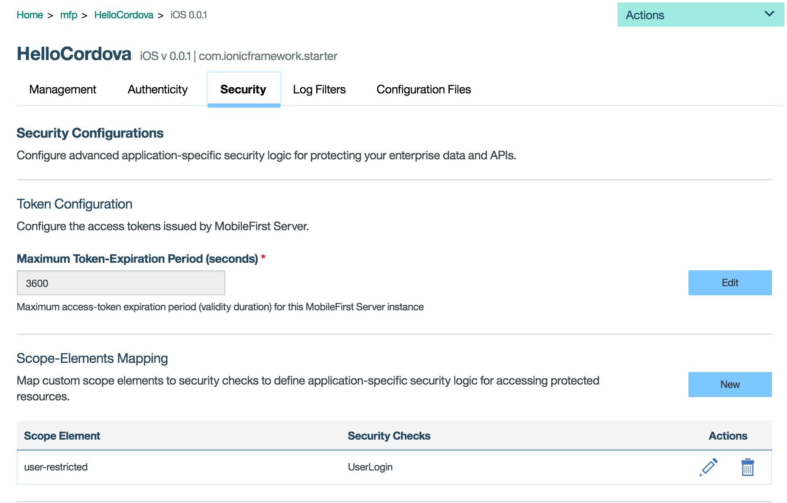

#  Mobile Foundation - Implement Login(Security)
> TODO: Discuss cannot test login adapter no swagger

## What you will learn on this guide
- How to use  Mobile Foundation Security Check

- `move the text bellow to the guide part`

- `add links to our getting started topics on this subject - as reference`

 In this section you will learn how to implement a secure login for your application.
  
 It is important to authenticate a user before they can access sensitive customer information. 
 We will do this by using the MobileFirst security framework to easily implement the OAuth2 protocol to do a handshake with the server for a live token every time a resource request is made via the adapter.

 When the app is first launched, it will take you to a login screen where you can sign into the app.
 In our example, the username and password used in the security adapter logic is such that the user name and password are the same values.

 In this lab you will explore the **Auth** service that will communicate between the **login controller** and the **security adapter**.

 Let's take a look at how this works.
 
 


## Requirement of this guide

- [Mobile Foundation Setup](/Lab/Contents/MFP-Setup-Mobile-Foundation-on-Bluemix/Readme.md)


## Guide

### Server Side Configuration

1 - Go to your UserLogin Adapter folder and build the adapter
```bash
cd ./MotoCorpServer/Adapters/UserLogin
mfpdev adapter build
```
2 - Upload the adapter to your MobileFirst console by selecting "Deploy Adapter" and uploading the `UserLogin.adapter` file.

3 - Map the `user-restricted` scope to the UserLogin security check inside the application security settings in the MobileFirst Foundation Operations Console.

The security framework ensures that only a client that passes all of the security checks of the protecting scope is granted access to the resource.



By adding `user-restricted` scope to a resource (in this lab, `CustomerAdapter`), MobileFirst allows you to easily map security scopes into each resource request so that the security frameworks triggers the mapped security checks.

```bash
@OAuthSecurity(scope = "user-restricted")
```

### Client Side Configuration 

#### Auth Service

In the services/auth.js file, the following The *login()* function uses the username and password that you type in and sends it to the UserLogin security adapter via the `WLAuthorizationManager.login` function to validate the credentials (if username and password are the same).

```js
login: function ($scope, username, password) {
      _$scope = $scope;

      // register the challenge handler for `UserLogin`
      bindChallengeHandler();

      if (!username || !password) {
        $scope.$emit('login-error', {
          message: 'Username and Password are required.'
        });
      } else if (authInProgress) {
        // if the authorization is in progress then submit the user credentials to the challenge handler
        challengeHandler.submitChallengeAnswer({'username': username, 'password': password});
      } else {
        // the first time the user clicks login submit the user credentials along with the security check name `UserLogin`
        WLAuthorizationManager.login(securityCheckName, {'username': username, 'password': password});
      }
    }
```

> > This lab uses the [UserLogin Adapter](https://mobilefirstplatform.ibmcloud.com/tutorials/en/foundation/8.0/authentication-and-security/user-authentication/security-check/) from the Getting Started tutorials. Please familiarize yourself with this in order to better understand the logic implemented on the client side.

#### Login Controller

In the **login.js** file, the following code snippet shows passes the username and password to the Auth service.

```js
Auth.login($scope, this.username.toLowerCase(), this.password.toLowerCase());
authInProgress = true;
```

The `Auth.login()` function sends the $scope object from the controller along with the **username and password** you enter to the Auth service.

```js
  $scope.$on('login-success', function () {
    authInProgress = false;
    $state.go('app.search');
  });

  $scope.$on('login-error', function (event, error) {
    alert(error.message);

    authInProgress = false;
  });
```

Once authenticated, you will be redirected to the customer search page.
If the login credentials are invalid, you will receive a popup describing the error.
Additionally, the MobileFirst security framework handles the time-to-live of the OAuth token so that when the token's life expires, a user will be redirected to the login page.


## Next guide

[MFP-MessageHub-Adapter](/Lab/Contents/MFP-MessageHub-Adapter/Readme.md)  
