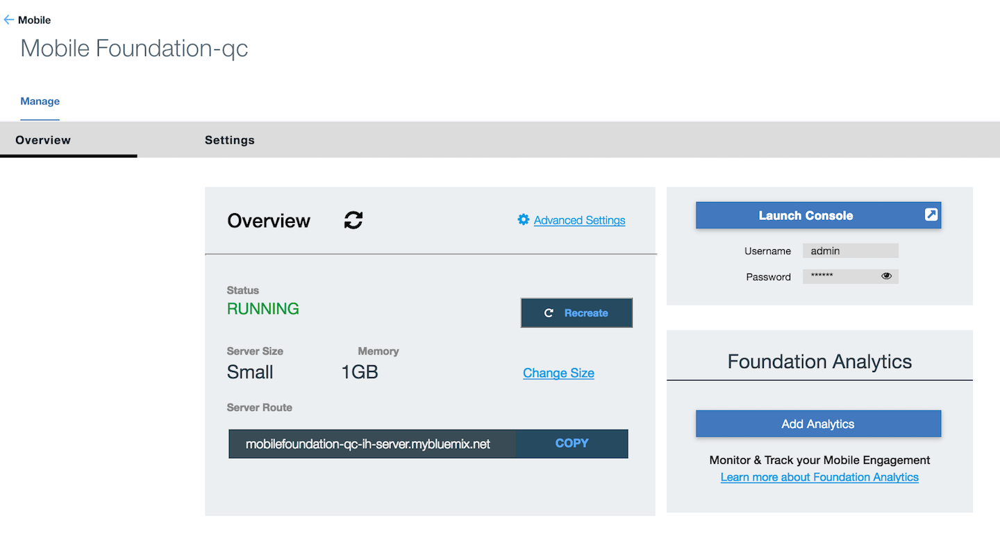

#  Setting Up Foundation on Bluemix

This tutorial will demonstrate how to setup the Foundation on Bluemix service.

## What you will learn in this guide

 - How to setup Mobile Foundation on Bluemix
 - How to setup Mobile Foundation CLI and configure it to your Foundation instance
 - How to setup the Ionic CLI

## Requirements of this guide

- No requirements

## Guide

1 - Instantiate [MobileFirst Foundation](https://console.ng.bluemix.net/catalog/services/mobile-foundation/) on Bluemix
and start your server.


Once you do so, please make a note of your server route as you will need to configure your route later.
Your route below is `mobilefoundation-qc-ih-server.mybluemix.net`


2 - Install [Node](https://nodejs.org/en/) 

3 - Install [Cordova](https://cordova.apache.org/docs/en/latest/guide/cli/)
```
npm install -g cordova
```

4 - Install [Ionic 1 CLI](http://ionicframework.com/getting-started/)
```bash
npm install -g cordova ionic@1.x
```

5 - Install the MobileFirst CLI
```bash
npm install -g mfpdev-cli
```

6 - Make sure to either by using JVM 1.7 or 1.8. You can check your java version in the CLI with
```bash
java -version
```

7 - Download and Install [Maven](https://maven.apache.org/install.html)

8 - Configure you mfpdev-cli to point to your Foundation Bluemix server
Included are the default settings for username/passwords.
Replace <server> with the server route you recorded in step 1.

```bash
mfpdev server add 
? Enter the name of the new server profile: bluemix-server
? Enter the fully qualified URL of this server: http://<server>:80
? Enter the MobileFirst Server administrator login ID: mfpRESTUser
? Enter the MobileFirst Server administrator password: mfpadmin
? Save the administrator password for this server?: Yes
? Enter the context root of the MobileFirst administration services: mfpadmin
? Enter the MobileFirst Server connection timeout in seconds: 30
? Make this server the default?: (Y/n) Y
```

## Supported Versions
- Java - 1.7 and 1.8
- mfpdev -v 8.0.0-2016101416 and earlier
- Cordova 6.2-6.4
- Ionic 1.7-2.1

## Next guide

[MFP-Security-Implement-Login](/Lab/Contents/MFP-Security-Implement-Login/Readme.md)    
