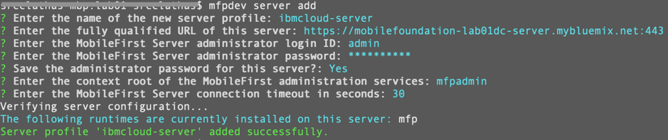

#  Setting Up Foundation on IBM Cloud

This tutorial will demonstrate how to setup Mobile Foundation service on IBM Cloud.

## What you will learn here

 - How to setup Mobile Foundation on IBM Cloud
 - How to set up and configure the Mobile Foundation CLI to talk to your Mobile Foundation server instance
 - How to setup the Ionic CLI

## Prerequisites

- No prerequisites.

## Procedure

1.	Log in to IBM Cloud. Search and select **Mobile Foundation** service from the Catalog.
2.	Select a pricing plan and click Create. This will create the Mobile Foundation service instance on IBM Cloud.
    >Note: For the purpose of this lab we will select the Developer plan.

3.	After the service instance is created, a page with Getting Started options is displayed.
4.	Go to **Service credentials** to get the details on serveruri, default userid and password.
5.	Click **Launch Console**, to launch the Mobile Foundation Operations Console.
    
6.	Install the latest version of [Node](https://nodejs.org/en/download/), based on your operating system.
    >Note: In this lab we have used node version 9.4.0 for macOS.

7.	Install the latest version of [Cordova CLI](https://cordova.apache.org/docs/en/latest/guide/cli/) for your operating system.
    >Note: In this lab we have used cordova version 9.0.0.

8.	Install [Ionic CLI](https://ionicframework.com/docs/installation/cli) using npm.
    >Note: In this lab we have used ionic version 4.2.1.

9.	Install Mobile Foundation CLI using the command below:
    ```bash
    npm install -g mfpdev-cli --no-optional
    ```
    >Note: Use the no-optional flag to get around a known issue described [here](https://mobilefirstplatform.ibmcloud.com/tutorials/en/foundation/8.0/product-overview/release-notes/known-issues-limitations/#mfpdev-cli-installation).

10.	Ensure you have installed Java and the version is 1.7 or 1.8.
11.	[Download](https://maven.apache.org/download.cgi) and [Install](https://maven.apache.org/install.html) Maven.
12. Configure your mfpdev-cli to point to the Mobile Foundations server on IBM Cloud. Use the information obtained from service credentials in step 4 to connect to the Mobile Foundation server from the mfpdev-cli.
    

<!--
## Guide

1 - Instantiate [MobileFirst Foundation](https://console.ng.bluemix.net/catalog/services/mobile-foundation/) on Bluemix
and start your server.


Once you do so, please make a note of your server route as you will need to configure your route later.
Your route below is `mobilefoundation-qc-ih-server.mybluemix.net`


2 - Install [Node](https://nodejs.org/en/). Please make sure to install v6.x.

3 - Install [Cordova](https://cordova.apache.org/docs/en/latest/guide/cli/)
```
npm install -g cordova
```

4 - Install [Ionic 1 CLI](http://ionicframework.com/getting-started/)
```bash
npm install -g cordova ionic@1.x
```

5 - Install the MobileFirst CLI
```bash
npm install -g mfpdev-cli
```

6 - Make sure to either by using JVM 1.7 or 1.8. You can check your java version in the CLI with
```bash
java -version
```

7 - Download and Install [Maven](https://maven.apache.org/install.html)

8 - Configure you mfpdev-cli to point to your Foundation Bluemix server
Included are the default settings for username/passwords.
Replace <server> with the server route you recorded in step 1.

```bash
mfpdev server add
? Enter the name of the new server profile: bluemix-server
? Enter the fully qualified URL of this server: http://<server>:80
? Enter the MobileFirst Server administrator login ID: mfpRESTUser
? Enter the MobileFirst Server administrator password: mfpadmin
? Save the administrator password for this server?: Yes
? Enter the context root of the MobileFirst administration services: mfpadmin
? Enter the MobileFirst Server connection timeout in seconds: 30
? Make this server the default?: (Y/n) Y
```
-->

## Supported Versions
- Java - 1.7 and 1.8
- mfpdev -v 8.0.0-2016101416 and earlier
- Cordova 6.2-6.4
- Ionic 1.7-2.1

## Next guide

[MFP-Security-Implement-Login](/Lab/Contents/MFP-Security-Implement-Login/Readme.md)    
