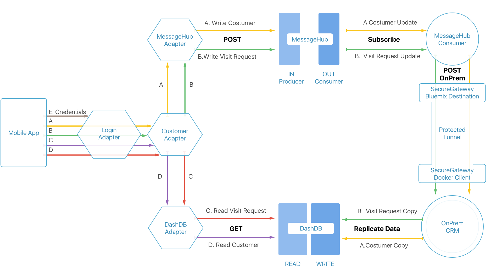

# Introduction

In this lab, we will be utilizing the Bluemix services: MobileFirst Foundation, DashDB, MessageHub, and SecureGateway.

Imagine you are an Enterprise that owns car service centers. You want to equip service center employees with apps that will help them coordinate activities in the service center to improve service times and quality of service.

One important element in this solution it is to allow your employees to have access to the most accurate data about your customer. As a customer can engage with your Enterprise via multiple channels.

> CRM: For this example we will use the CRM idea to be a central place to store/retrieve the most updated information about a customer and to open and post tickets [Read more here](https://en.wikipedia.org/wiki/Customer_relationship_management)

So through this example we will explore a possible architecture that would allow an Enterprise that already has an OnPrem CRM solution, to expose the CRM data to a mobile app for its Service Centers employees, so they can deliver better customer service.

This example will cover how to do this asynchronously. The mobile app will be reading from a cached data repository (DashDB) which will be updated as frequently as possibly. The mobile app will also be writing (creating new customers/visits) via a messaging system (MessageHub). This allows the CRM to consume updates in a more controlled flow, mitigating the peaks and valleys of a service center working day. So if needed, more resources can be added to the CRM to support more load throughout the day, to keep data updated with less latency.

## Data Flow 

In this lab you will be able to create new customers and new visits (for that customer) within the mobile app. We will be following the diagram above in explaining how the process flow is for creating a new visit.

1. Write
 - User creates a new visit in the mobile app (Mobile App)
 - Login adapter validates that the OAuth token for that user is valid (Login Adapter)
 - Customer Adapter is the main adapter for requests and forwards it to the MessageHub Adapter (Customer Adapter)
 - MessageHub Adapter creates a new visit (topic) request to MessageHub (MessageHub Adapter)
 - MessageHub creates a new visit topic (MessageHub)
 - MessageHub Consumer subscribes to the visit topic and receives the new visit topic and updates the CRM (MessageHub Consumer)
 - SecureGateway creates a tunnel through the firewall so that the consumer can reach the onPrem CRM (SecureGateway)
 - The OnPrem CRM receives the new visit and replicates the new visit to DashDB (DashDB)
2. Read
 - User requests to view information on a specific visit (Mobile App)
 - Login adapter validates that the OAuth token for that user is valid (Login Adapter)
 - Customer adapter forwards that request to the DashDB Adapter (Customer Adapter)
 - DashDB adapter queries DashDB for that specific visit (DashDB Adapter)
 - DashDB runs the query and returns the result back to the DashDB Adapter (DashDB)

# Foundation Features
  - User Authentication: Login/Logout of the app & user identity. More details in the [MFP-Security-Implement-Login](/Lab/Contents/MFP-Security-Implement-Login/Readme.md)
  - Adapter mashup so you can easily change the backend source of your data. More details in the 
[MFP Customer Adapter](/Lab/Contents/MFP-Customer-Adapter/Readme.md)
  - Easily update your API parameters. More details in the 
[MFP-DashDB-Adapter](/Lab/Contents/MFP-DashDB-Adapter/Readme.md)
  - API Protection: Only an authorized user can consume a given service, exposed to the mobile app.
  - Exploring Ionic for User Interface (mobile app) in the [MFP-Ionic-MobileApp](/Lab/Contents/MFP-Ionic-MobileApp/Readme.md)
  - Collecting app usage metrics in the [Bluemix-Mobile-Analytics](/Lab/Contents/Bluemix-Mobile-Analytics/Readme.md)

# Backend Services
  - Mock CRM: A NodeJS based application that will act as a mock CRM to allow you to easily replicate the content of this sample, and mimic an OnPrem system of record.
  - Secure Gateway: A set of guides on how to expose your OnPrem CRM to a Bluemix based service in a way that can be only be consumed by your Bluemix based apps.
  - DashDB: Using this data store service to act as a mirror of your CRM to reduce the pressure of consuming it online from your OnPrem enviroment and also improve the responsiveness of your mobile app.
  - MessageHub: A service to allow a better pipeline to allow a more asynchronous data propagation of the data from your mobile app to an OnPrem CRM.
  
# Scenario Considerations

- Replacing a desktop user interface to a mobile based system so that the following challenges can be handled:
  - **More user interaction, more pressure on backend systems**: [MobileFirst Adapters](https://mobilefirstplatform.ibmcloud.com/tutorials/en/foundation/8.0/adapters/) are a great help to manage the pressure sent to your backend systems.

  - **Mobile users want apps to be responsive**: [Ionic](http://ionicframework.com/) is a great front end framework to build a good user interface that integrates well with MobileFirst Foundation. MobileFirst Foundation allows you to use any front end framework you choose.

  - **Once you have a mobile app available, users will demand improvements and new features**: [MobileFirst Console](https://mobilefirstplatform.ibmcloud.com/tutorials/en/foundation/8.0/setting-up-your-development-environment/console/) and features like [MobileFirst Direct Update](https://mobilefirstplatform.ibmcloud.com/tutorials/en/foundation/8.0/using-the-mfpf-sdk/direct-update/) will help you keep your app development/delivery cycle at pace with user demands.

  - **Understanding your mobile app users**: [MobileFirst Analytics](https://mobilefirstplatform.ibmcloud.com/tutorials/en/foundation/8.0/analytics/) will give you insights into what users are doing with your app, and in this lab we will explore how to leverage this tool.

  - **A mobile app is one of many channels through which users can interact with your backend systems**: In these labs we will explore [IBM DashDB](https://console.ng.bluemix.net/catalog/services/dashdb/) and [IBM MessageHub](https://console.ng.bluemix.net/catalog/services/message-hub/) to act as part of a pipeline to build a very responsive mobile app. Allowing service centers to have the most up to date info as possible to act on, and also alleviate the pressure on the backend system.

  - **Enterprise Mobile Apps are usually served by a combination of cloud services & backend systems that may be installed in the Enterprise Data Center**: This example will also explore [IBM Secure Gateway](https://console.ng.bluemix.net/catalog/services/secure-gateway/) to allow MobileFirst on Bluemix to host APIs that will propagate changes to an OnPrem System, while allowing only the MobileFirst mobile app servers to reach the OnPrem system from Bluemix. This limits exposure of your OnPrem services to authenticated users - a standard hybrid cloud scenario.
