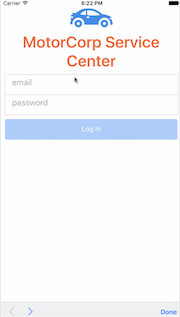
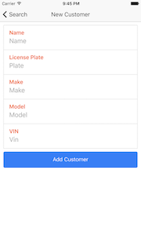
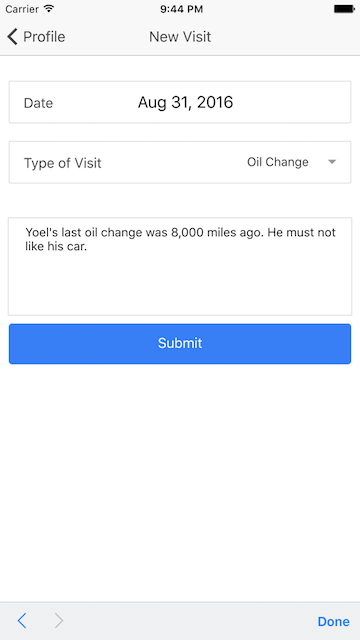
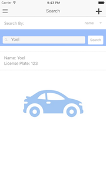
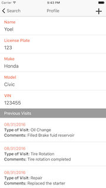

## License

Refer to License.md

## Overview
This car service center app demonstrates multiple Foundation features coupled with Bluemix Services to create an app that works seamlessly for the customer.

## Mobile iOS Application

The application has the following 5 screens and functionality.

### Login

### New Customer

### New Visit

### Search Customers

### Customer Profile

## Labs
Included in this project are a set of labs located [here](/Lab/Readme.md) where there is a detailed overview as well as steps on how to get the lab up and runnings.
